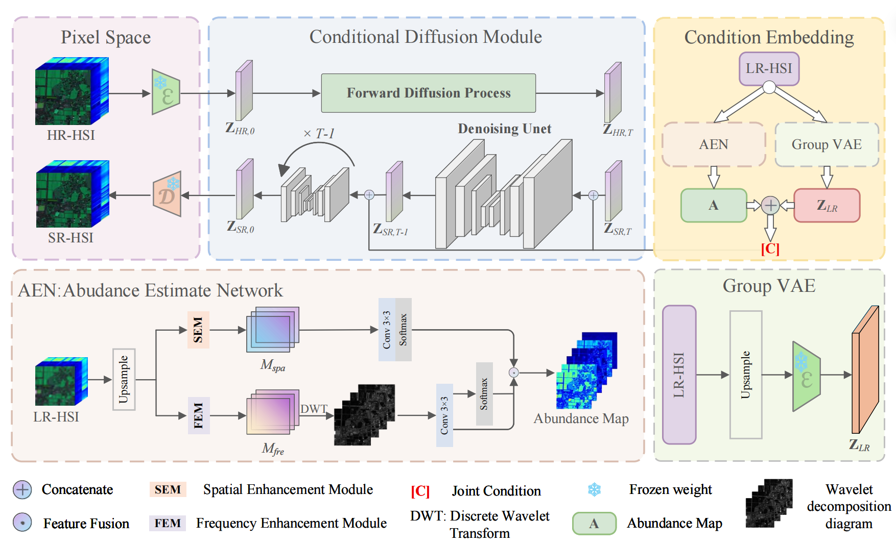
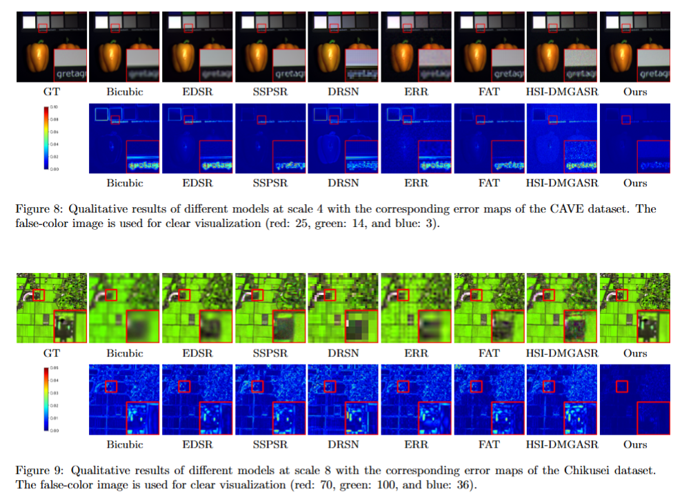
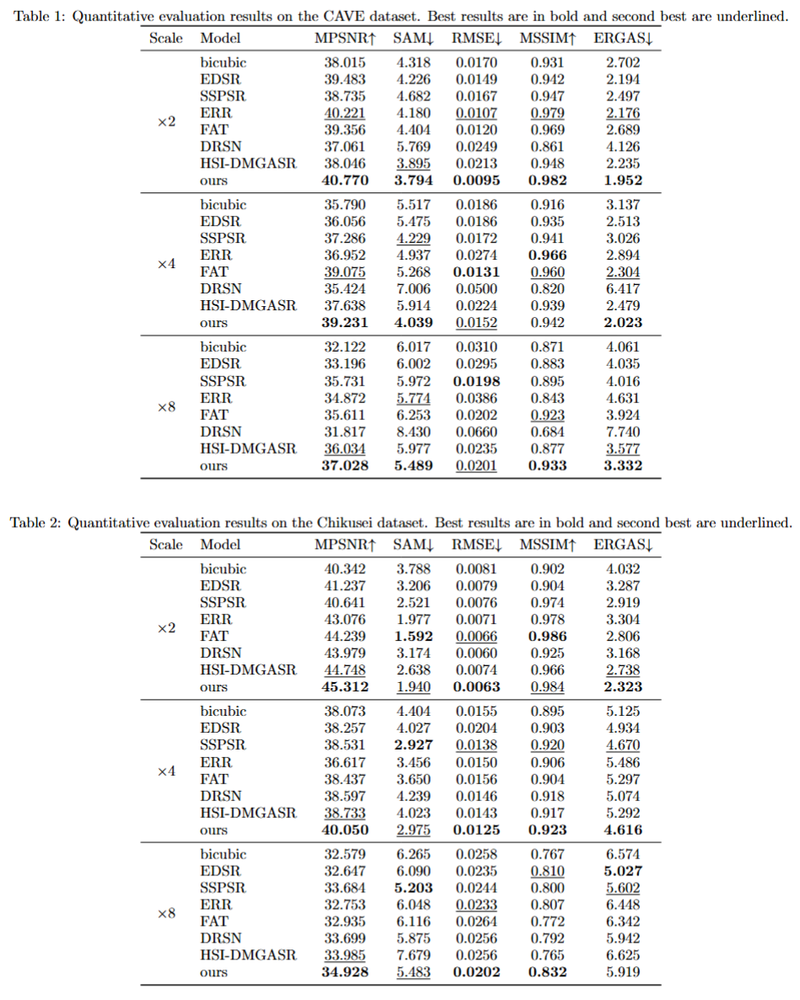

# Abundance Prior-Guided Latent Diffusion: A Spatial-Frequency Coordinated Multi-Modal Framework for Hyperspectral Super-Resolution

Code for papaer Abundance Prior-Guided Latent Diffusion: A Spatial-Frequency Coordinated Multi-Modal Framework for Hyperspectral Super-Resolution.

## The proposed framework

## The visulization of the HSI-SR reconstructed results

## The quantitative results of CAVE and Chikusei dataset

